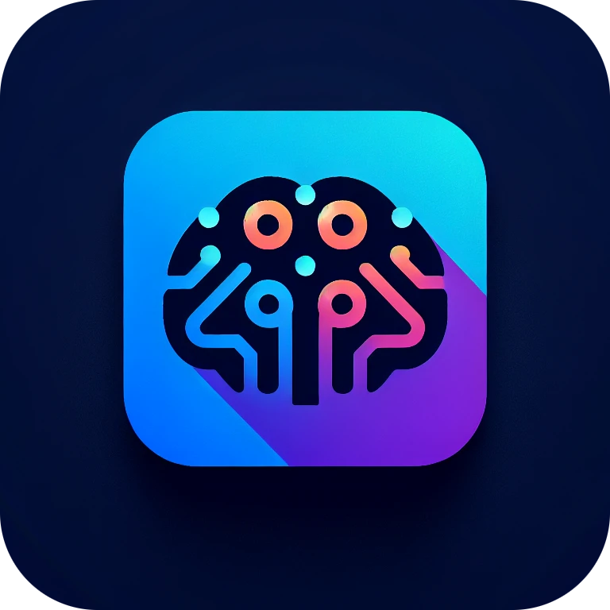

<h1 align="center">

CREAIT
</h1>

其它语言：<a href="./README.md">English</a>

## CREATI
CREAIT (CRE AI Tool 或 CREative AI Tool) 是个能利用现有的强大AI的强大的工具。

## CREAIT介绍
### 开发动机
我觉得当前最好的利用ChatGPT这样的AI的方式是通过API客户端（毕竟官方网页也只是个API客户端）。现有的客户端比较好用的是一个叫ChatBox的软件，但这个软件有个大问题：它是个假开源，它声称自己开源但实际上是闭源的，这就很有欺骗性了，我觉得不太好。而且闭源也导致了你没法往上面加你想要的功能，这个项目也没法借助开源社区的力量。也许是因为没有很好的竞品，导致作者想怎么弄就怎么弄吧。

所以我自己开发了个真正开源，并且仍然很强大很多功能的AI工具，就是这个CREAIT。其实我在这网页开发方面完全是小白，接住了很多ChatGPT的力量才快速开发出来。当前功能已经比较完善了。它是MIT协议的，所以任何人都可以用它做任何事或者任意修改它。

### 功能
CREAIT现在可以利用OpenAI的API，不仅可以和著名的ChatGPT聊天(gpt-3.5 or gpt-4)，还可以用dall-e或者tts-1来生成图片或者语音（这个我目前没发现有其它这种综合性工具有这个功能）。

下面是部分已经实现的功能和计划实现的功能：
-   [x] 和ChatGPT交谈
-   [x] 使用dall-e模型生成图片
-   [x] 使用tts-1模型生成语音
-   [x] Markdown和代码显示
-   [x] 自定义模型（在应用里添加其它聊天模型，或者在代码里方便地自定义模型）
-   [x] 流式聊天
-   [x] 聊天单独设定
-   [x] 角色设定和保存
-   [x] 自动生成聊天名
-   [x] 显示Token用量信息
-   [x] 保存图片
-   [x] 多语言支持
-   [ ] 代理
-   [ ] 备选按钮
-   [ ] 显示上下文范围
-   其它...

## 怎么贡献代码
0. [可选] 创建issue提出需求。
1. Fork项目到你自己的库里。
2. 修改并提交代码。
3. 向我提交PR。

## 开源声明
本项目里用到的开源项目代码：
-   marked (https://github.com/markedjs/marked)
-   PrismJS (https://prismjs.com/)
-   fa (https://fortawesome.com)

## 支持
如果你喜欢这个项目，给个打赏呗~

|支付宝|微信|
|------|------|
||
|||