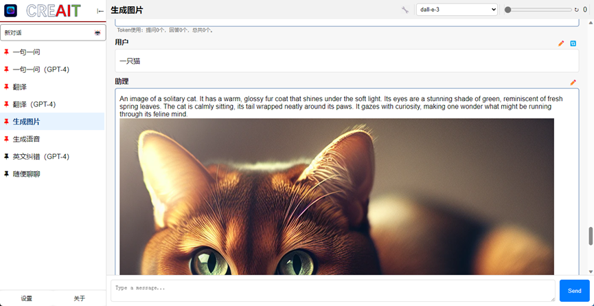
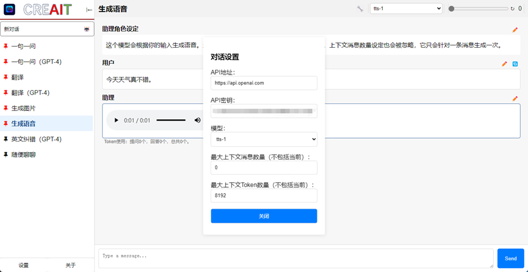

# 当前使用OpenAI（ChatGPT）姿势分享
TL;DR太长不看版：1.下载文章末尾的程序CREAIT，安装启动。2.<a href="https://openai-hk.com/?i=3732">https://openai-hk.com/?i=3732</a>点右上角控制台，微信扫码注册，然后在里面找到“获取key”，然后复制hk开头的key。3.在CREAIT设置里把API地址改为https://api.openai-hk.com，key改为你刚才复制的hk开头的key。搞定！Enjoy！

## 正文
不管未来AI会走向何方，我觉得至少在当下，AI作为一个生产力工具，已经代表了生产力的一个新的台阶，所以，利用AI，我觉得是当代每一个人想要更好地工作或生活都十分重要的技能。那么如何更好地利用AI呢？我有一些心得。

当前国内大语言模型正在蓬勃发展，但是据说，和OpenAI的ChatGPT（特别是GPT4）还是有一些差距。特别是本月初发布的新的GPT4，更好更快更便宜，甚至可以支持128k token的输入，可以放进去一本书让它读了。但是由于一些众所周知的原因，国内内地和香港地区，没有办法方便地使用OpenAI的服务。就算前几天OpenAI注册不需要手机号了，但想要用API或者GPT4还是很不方便，并且随时有封号的风险。我就是因为前段时间一直挂在美国朋友账号下的账号被封了，才开始研究国内使用ChatGPT的更优雅的姿势的。
我个人觉得，使用ChatGPT，最好的方式是通过API，更灵活更方便。毕竟，ChatGPT网站上的服务也只是用API写的应用而已。更重要的是，网站上如果你想用GPT4，需要每月20刀，这个还是太贵了，而API是按量付费，用多少付多少，只要把握好省token技巧，要便宜得多。

说了这么多，那怎么在国内方便地使用ChatGPT呢？答案是通过国内的代理商。使用代理商有三大好处：不用科学上网，付费方便，不用担心封号。我在被封号后，找了好几家代理商，比较之后，发现一家最好用的。这家按照token计费，而且价格和官网一样（3.5甚至更便宜）。这是我的邀请链接：<a href="https://openai-hk.com/?i=3732">https://openai-hk.com/?i=3732</a>。注册也很方便，扫码登录就行了。注册代理商之后，它会给你一个api-key（和官方API使用一样）。

现在你有了API-key，那么怎么使用API呢？当然需要一个利用API的客户端。之前有一个比较好用的客户端叫ChatBox，我也一直在用，但是这个ChatBox有个大问题：它是个假开源。它声称自己开源但实际上是闭源的，这就很有欺骗性了，我觉得不太好。而且闭源也导致了我想要什么功能没办法自己家，完全要看作者脸色。所以，我花了两周时间，利用ChatGPT自己写了一个客户端：<a href="https://github.com/CoREse/CREAIT">CREAIT</a>（<a href="https://github.com/CoREse/CREAIT">https//github.com/CoREse/CREAIT</a>），ChatBox的功能CREAIT基本全有，甚至还有独有的功能：可以生成图片和生成语音。并且这个客户端是真开源（MIT协议），谁都可以改，谁都可以用。

下面来具体说一下怎么用和一些技巧：
安装CREAIT后在设置里面，把API地址改成https://api.openai-hk.com，然后API密钥就复制刚才那个给你的api-key，hk开头的那个，然后就行了，你就可以和ChatGPT聊天啦！

我预设了几个我觉得比较好用的角色设定，这个角色设定就是你希望AI以什么身份什么行为回答你。你自己设定的角色也可以右键保存（包括角色设定文本，对话设定（API，模型，token数量等）。这两个一句一问是我用得最多的设定，这个其实它的“角色设定”文本不重要，重要的是设定上下文数量为0。因为大多数时候，其实你只需要AI对你发过去的这一条消息进行回应，不需要并且不希望AI去读你们的历史消息，这个“一句一问”就是说一个问题只包含这一句消息，和上下文无关。这样不仅防止了上下文干扰，而且ChatGPT的上下文记忆是通过把上下文的所有消息都发过去的，而我们前面说了，API是按照Token，也可以理解为文本量来计费的，当你不需要上下文的时候，就不发送，就可以省掉上下文的token开支了。

我把这些都分为了GPT-3.5和GPT-4，主要原因就是，GPT-4比GPT-3.5要贵得多。前面说的省token，其实对于GPT-3.5来说意义并不是特别大，因为GPT-3.5实在是太便宜啦！用我前面说的那个代理商甚至更便宜，一块钱可以用到天荒地老。但GPT-4就要贵得多了。一句简单的问答可能就要一两毛钱，消息多了会更贵（当然一个月要用到GPT官方会员的20美刀还是很不容易的）。我这个软件会在下面显示估计用到的Token数，误差在个位数吧。前面提到的代理商会告诉你每一条消息用了多少token，这个挺好的。

然后是生成图片，我前面提到的代理商只支持比较高级的dall-e-3模型，大概一张图片2毛钱。官方API支持dall-e-2或者3，每张价格从几分钱到几毛钱不等。你就把你需要的图片的描述告诉它，它就会给你返回它生成的图片，以及实际上生成图片所用的prompt（它根据你的描述生成的实际用来生成图片的描述）。右键点击图片可以复制或保存图片。

至于语音生成，这个我前面提到的代理商暂时没有，只能通过官方API来用。其实我这个软件可以对每个对话单独设定各种设置，包括API地址API Key还有模型等（未来还能设定代理）。所以你可以在这里设置官方地址和API，然后可以开个全局代理或者建立反向代理。对每个对话的单独设置会覆盖全局设定，但并不会更改全局设定。

生成的声音显示如下：点击三个点可以选择保存声音。

至于代理，这个暂时没有弄清楚tauri下面要怎么实现内外通信和实时更改代理，以实现我想要的功能，所以暂时没有实现，之后会实现的（大不了换回electron，在electron下怎么弄我有思路）。如果有同学懂怎么弄的可以说一下。

现在给一个替代品，反向代理。你设置一个本地反向代理，将流量通过代理转到官方API地址，我在网上找到一个代理go程序，以及我写的运行脚本分享在<a href="reverseproxy">这里</a>。你需要先安装golang，然后把run.bat（需要把你下载的go程序的位置替换掉里面的[Your go location (C:\xxx)]）用nssm加到windows服务里，让它自动启动，然后把官方的API地址改成127.0.0.1:8080就ok了。

大概就是这么多！祝大家工作学习生活顺利！

<a href="https://github.com/CoREse/CREAIT/releases/latest">下载CREAIT</a>

<a href="https://github.com/CoREse/CREAIT/tree/master/docs/reverseproxy">反向代理</a>
